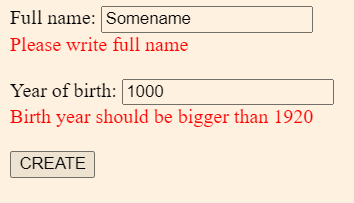
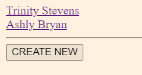
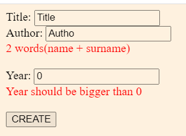
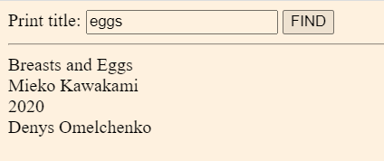

# Library
This is a Spring MVC project that implements CRUD (Create, Read, Update, Delete) operations, validation, pagination
and other things from Spring/Hibernate/JPA. 
It provides a basic web interface to manage a library.

# Prerequisites
* Make sure you have the following installed:
* Java Development Kit (JDK) version 9 or higher
* Apache Maven

* MySQL Server
# Getting Started
Follow these instructions to get the project up and running on your local machine.
1. Install Java Development Kit (JDK).
1. Download the repository to your local machine or clone it by `git clone https://github.com/denomelchenko/Library.git`
1. Configure the database:
   * Create a new MySQL database by DB file.
   * Rename file hibernate.properties.origin to hibernate.properties configuration.
   * Update your hibernate.properties file.
1. Build the project:
   `mvn clean install`
1. Run the project:
   `mvn tomcat7:run`
1. Open your web browser :
  * Navigate to http://localhost:8080/users to access the users panel.
  * Navigate to http://localhost:8080/books to access the books panel

# Usage
The application provides a simple web interface with the following CRUD functionality:
* Create: Add a new user/book to the Database.
* Read: View the details of an item from Database.
* Update: Modify the information of an existing item.
* Delete: Remove an item from the collection.
* You can assign a book to a user.
* The book is marked as overdue if the user does not return it to the library within 10 days.
* You can assign the book to different users, and it can also be available in the library.
* In the project, book and user validation is implemented.
* Yes, I can sort books by their publication year.
* You can sort the books by the year of publication.
* Additionally, you can find a book by entering its title.

# Technologies Used
* Spring MVC - Web framework
* Hibernate
* Java Persistence API
* Validation of items
* MySQL - Relational database management system
* Maven - Build and dependency management tool
* Tomcat - Web server

# Screenshots 
## For users: 

# For books:

# Contributing
Contributions are welcome! If you find any issues or would like to add new features, please submit a pull request.

# License
This project is licensed under the MIT License. See the LICENSE file for details.